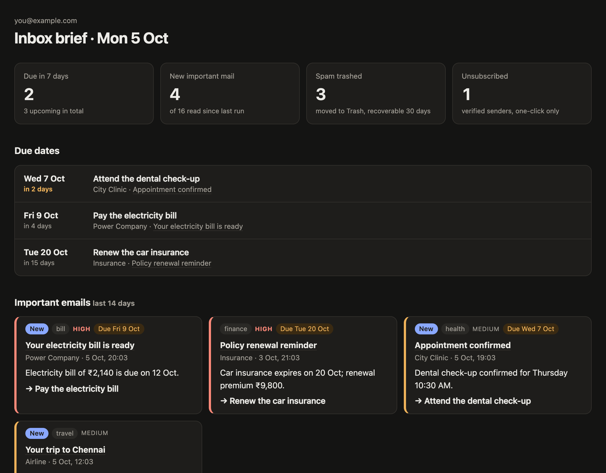

<h1 align="center">📬 Email Cleanup Bot</h1>

<p align="center">
  <b>Spam piles up, and the mail that matters gets buried under it.<br>
  Every morning this bot empties the spam and shows what needs you on one page.</b>
</p>

<p align="center">
  
</p>

<p align="center">
  
  
  
  
</p>

<p align="center">
  
</p>
<p align="center"><sub>The morning dashboard (sample data): what's due, the important mail, and the spam that was cleared</sub></p>

## 💡 Why

Unsubscribing from spam tells scammers your address is real, so most people just let it pile up. Meanwhile a bill,
an appointment or a renewal hides between newsletters. This bot clears the junk safely and pulls out the few emails
that actually need you, with their due dates.

## ⚙️ How it works

<table>
  <tr>
    <td align="center" width="33%"><h3>🧹</h3><b>Clears the spam</b><br><sub>Everything in Spam goes to Trash (recoverable for 30 days)</sub></td>
    <td align="center" width="33%"><h3>🛡️</h3><b>Unsubscribes safely</b><br><sub>Only from real, verified businesses, with one click, never from scammers</sub></td>
    <td align="center" width="33%"><h3>📋</h3><b>Shows what matters</b><br><sub>A dashboard of important mail, one-line summaries, actions and due dates</sub></td>
  </tr>
</table>

A due date is shown only if the email itself states it. You get a Mac notification when the morning run is done.

## 🚀 Set it up

<table>
  <tr>
    <td align="center" width="33%"><b>1 · Fill in</b><br><sub>Copy <code>.env.example</code> to <code>.env</code>: a Google OAuth client (Gmail API on)</sub></td>
    <td align="center" width="33%"><b>2 · Log in once</b><br><sub><code>npm run login</code> and choose the mailbox to clean</sub></td>
    <td align="center" width="33%"><b>3 · Switch it on</b><br><sub><code>npm run schedule</code>. To run now and open the dashboard: double-click <code>run-now.command</code></sub></td>
  </tr>
</table>

Needs a Mac with Node 24+ and [LM Studio](https://lmstudio.ai) with Qwen3.8 27B.

## 🔒 Private by design

The Google permission can read mail and move it to Trash; it can't send mail or delete anything for good. Your
login stays in `.env` and the summaries in `data/` on your Mac. The AI runs on the Mac; no mail goes to the cloud.

<details>
<summary><b>🛠️ For developers</b></summary>

<br>

<p>
  
  
  
</p>

- **One run = collect → decide → act.** Collect: Gmail spam (up to `maxSpam`) and inbox mail since the last run (not
  Promotions/Social/Forums). Decide: the model triages spam and summarises inbox mail (JSON schema), 2 requests at
  a time. Code-side rules: unsubscribe only with an RFC 8058 one-click https header **and** Gmail-verified DKIM for
  the From domain **and** a "marketing" verdict; a due date only if its words are quoted from the email. Act:
  one POST per domain, move spam to Trash, write `data/dashboard.html` (no scripts, CSP, all text escaped).
- **The model** is shared with the other bots through a lease protocol (`kit.js`); if it can't be had, the run exits
  75 and is retried.
- **Scheduling:** launchd runs `node kit.js tick` every 5 min (once per slot, 10 min after wake, retries, 10 h limit).

```
bot.js            the run: collect → decide → act
sources.js        Gmail API and the one-click unsubscribe POST
rules.js          prompts, schemas, unsubscribe and due-date rules, dashboard HTML (pure, tested)
kit.js            shared kit: config, log, store, model sharing, Google login, run, scheduler
test.js · kit.test.js       npm test
config.json       public settings (runTimes, firstRunHours, maxInbox, maxSpam, model)
.env.example      personal values template (.env is gitignored)
pii-check.sh      personal-data gate            run-now.command   double-click = npm start -- --open
data/             (gitignored) bot.db · bot.log · run.out · schedule.json · dashboard.html
```

**Commands:** `npm start [-- --open]` · `npm test` · `npm run login` · `npm run schedule` / `unschedule`.
**When something fails:** a macOS notification and a "Problems" list on the dashboard; details in `data/bot.log`.
**License:** MIT.

</details>
